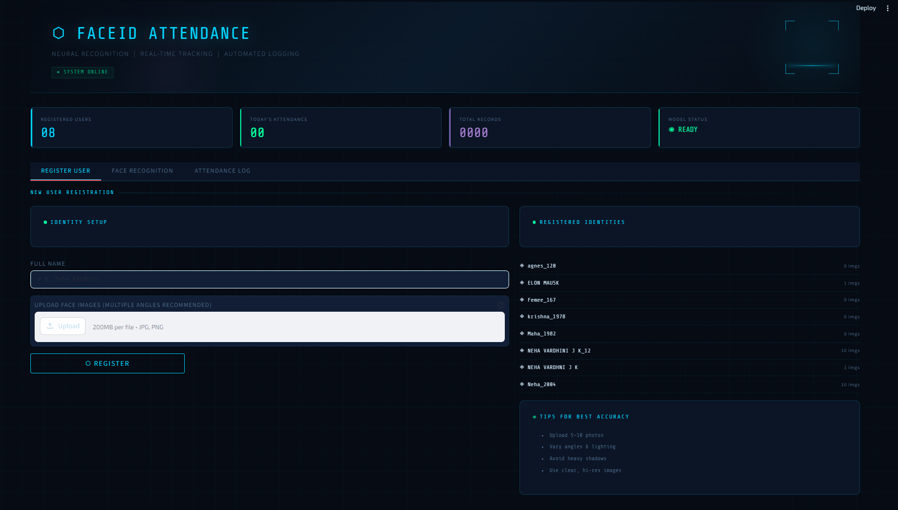
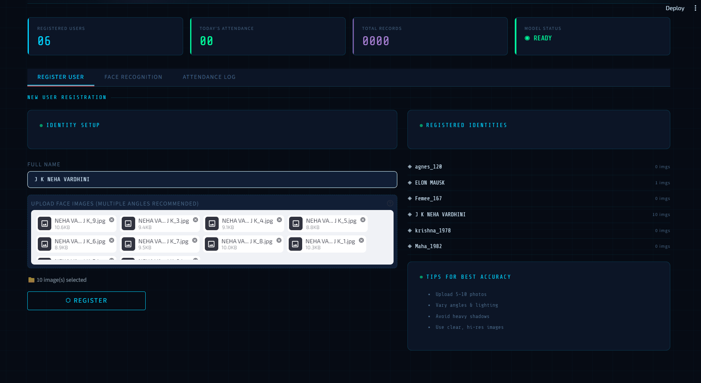
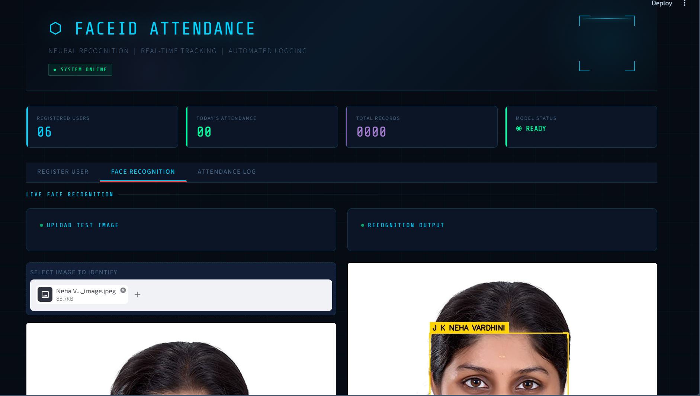
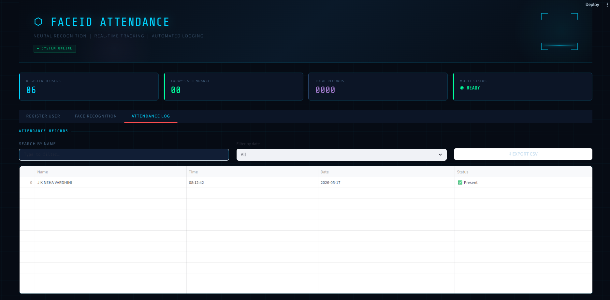

<div align="center">
  
[](https://git.io/typing-svg)


# 
<br/>


<br/>

> **A real-time face recognition–based attendance system** built with OpenCV, KNN, and Streamlit — deployed live on Streamlit Cloud.

**[🚀 Live Demo](https://face-recognition-app-app-4voyybbgfuwxk7kadkp2rn.streamlit.app/)** · **[📸 Screenshots](#-results--screenshots)** · **[⚙️ Setup](#%EF%B8%8F-local-setup)**

</div>

---

## 📌 Overview

**FaceID Attendance** is an undergraduate project that automates classroom/office attendance using facial recognition. Upload a photo — the system detects the face, identifies the person, and logs their attendance instantly with a timestamp.

The app features a custom **dark-tech / cyber aesthetic UI** built entirely in Streamlit using CSS overrides, animated scan-line effects, and a responsive layout.

---

## ✨ Features

| Feature | Description |
|---|---|
| 🔍 **Face Detection** | Haar Cascade classifier for robust frontal face detection |
| 🧠 **KNN Recognition** | K-Nearest Neighbours model trained on uploaded face images |
| 📋 **Attendance Logging** | Auto-logs Name, Time, Date & Status to CSV (one entry per person per day) |
| 📊 **Live Dashboard** | Real-time stats — registered users, today's count, total records, model status |
| 📁 **Export CSV** | Download the full attendance log with one click |
| 🔎 **Search & Filter** | Filter attendance by name or date |
| 🎨 **Cyber UI** | Animated grid background, scan-line effects, neon color palette |

---

## 🖥️ Results & Screenshots

> Screenshots and working demo videos are available in the [`results/`](./results/) folder.

### 🏠 Dashboard — Hero Banner & Stats


### 📝 User Registration Panel


### 🔬 Face Recognition in Action


### 📋 Attendance Log with Filter & Export


> 🎬 **Video demo** → see [`results/demo.mp4`](./results/working_face_recognition_streamlitapp.mp4)

---

## 🛠️ Tech Stack

```
Frontend / UI   →   Streamlit + custom CSS (dark-tech theme)
Face Detection  →   OpenCV (Haar Cascade — haarcascade_frontalface_default.xml)
Recognition     →   scikit-learn KNeighborsClassifier
Image Processing→   OpenCV, NumPy, Pillow
Data Storage    →   CSV (pandas), joblib (model serialization)
Deployment      →   Streamlit Community Cloud
```

---

## 📁 Project Structure

```
face-recognition-streamlit-app/
│
├── streamlit_app.py                    # Main application
├── haarcascade_frontalface_default.xml # Face detection model
├── requirements.txt                    # Python dependencies
├── runtime.txt                         # Python version for deployment
│
├── static/
│   ├── faces/                          # Registered user face images
│   │   └── <UserName>/                 # One folder per person
│   └── face_recognition_model.pkl      # Trained KNN model (auto-generated)
│
├── Attendance/
│   └── attendance.csv                  # Attendance log
│
└── results/                            # Screenshots & demo videos
```

---

## ⚙️ Local Setup

### Prerequisites
- Python 3.9+
- pip

### Steps

```bash
# 1. Clone the repository
git clone https://github.com/jk-neha/face-recognition-streamlit-app.git
cd face-recognition-streamlit-app

# 2. Install dependencies
pip install -r requirements.txt

# 3. Run the app
streamlit run streamlit_app.py
```

The app will open at `http://localhost:8501`

---

## 🚀 How It Works

```
1. REGISTER  →  Upload 5–10 face photos for a person
                System saves images & trains the KNN model automatically

2. RECOGNIZE →  Upload a test image
                OpenCV detects the face → KNN predicts identity
                Bounding box + label drawn on result image

3. LOG       →  Attendance auto-marked (once per person per day)
                Viewable, searchable & exportable from the Attendance tab
```

---

## 📦 Dependencies

```txt
streamlit
opencv-python-headless
numpy
pandas
Pillow
scikit-learn
joblib
```

> See [`requirements.txt`](./requirements.txt) for exact versions.

---

## 📖 How to Use the Live App

1. Go to the **[Live Demo](https://face-recognition-app-app-4voyybbgfuwxk7kadkp2rn.streamlit.app/)**
2. **Register** — Enter a name and upload 5+ face photos, click `REGISTER`
3. **Recognize** — Switch to the Face Recognition tab, upload a test photo
4. **View Logs** — Check the Attendance Log tab to see who was marked present

---

## 🔮 Future Enhancements

- [ ] Real-time webcam stream recognition
- [ ] Multi-face detection in a single frame
- [ ] Deep learning model (FaceNet / DeepFace) for higher accuracy
- [ ] Email/SMS alerts on attendance marking
- [ ] Admin dashboard with charts and analytics
- [ ] Database integration (SQLite / Firebase)

---

## 👩‍💻 Author

**Neha* Vardhini J K* · [@jk-neha](https://github.com/jk-neha)

> *Undergraduate Project — Face Recognition Attendance System*

---

## 📄 License

This project is open-source under the [MIT License](./LICENSE).

---

<div align="center">

⭐ **Star this repo** if you found it useful!

[](https://github.com/jk-neha/face-recognition-streamlit-app)

</div>
